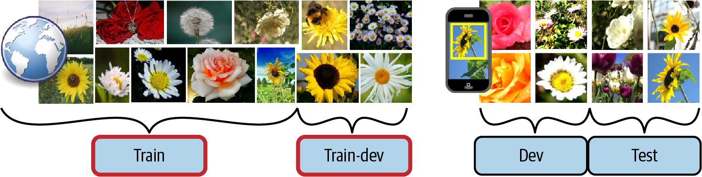

# Main Challenges of Machine learning
You can get a "bad model" and "bad data".

### Insufficient Quantity of Data
- Lots of data for machine learning to perform on simple problems.
	- Data matters more than algorithms for complex problems, but don't abandon algorithms just yet.

### Non representative Training Data
- You need representative data of the cases you want to generalize.
- If the dataset is to small you get a *sampling noise* (non representative data as a result of chance).
- Larger datasets can be non representative if the sampling method is flawed, called *sampling bias*.

### Poor quality data
- You'll want to clean up your data most of the times, and spend time on it.
	- If your model is fed with errors, outliers and noise, it will make it hard to detect patterns and perform well.

### Irrelevant features
- Your system will only learn if the training data contains enough relevant features and not many irrelevant ones.
- Feature engineering.
	- Feature selection.
	- Feature extraction.
	- Creating new features by gathering new data.

### Over fitting the Training Data
- Model overgeneralize in a bad way, this is called *overfitting*, meaning it goes well on the training data but does not generalize well.
- If the data is too noisy and small, the model cant determinate whether a pattern is real or is simply the result of noise in the data.
- Overfitting happens when the model is too complex relative to the amount of training data and noisiness.
	- Constraining to reduce the risk and make it simpler is called *regularization.*
		- The amount of regularization can be controlled by a *hyper parameter*, that is a parameter of the algorithm itself.

### Under fitting the Training Data
- Opposite to overfitting, this means the model is too simple for the underlying data.
	- Options for fixing this:
		- Select a more powerful model, with more params.
		- Feed better features.
		- Reduce the constraints (hyper parameter).

### Testing and validating
- Only way to know how well your model generalizes to new cases is to try out new cases.
	- A good way is to split your data with *training data* and *test data*.
	- *Error rate on new cases is called generalization error.*
- If the training error is low, but the generalization error is high, it means the model is *overfitting* your data.

### Hyper parameter tuning and Model selection
- When tunning the hyper parameter while training to get the lowest regularization error, something unexpected can occur.
	- We trained our model(s) multiple times on the same training set tweaking the hyper parameter and when we get the lowest one, we think it can perform well on new cases, but no.
	- What happened there, is that we got the lowest regularization error for that *specific training set*. Meaning, it wont perform well on new cases now.
- Holdout validation.
	- You simply hold out part of the training set to evaluate several candidates and select the best one.
	- The new held out set is called *validation set*. Now you train multiple models on the reduced validation set and select the best performer.
	- After this hold out you train that model with the full training set, and this gives you the final model.
	- Lastly you evaluate on the test set to get an estimate of the generalization error.

### Data Mismatch
- In some cases it would be easy to get large amounts of data, but this data wont be perfectly representative of the data that will be used in production.
- An example can be a mobile app to take photos of flowers and determinate their species, you can easily download millions of photos from the web, but maybe that data is not what the final production data is gonna look like and wont be representative as of like taking pictures with the mobile app.
	- So, you have divided in validation and test sets (correctly divided, both almost as equal representative). After training your model if you see that the performance is disappointing on the validation set, you wont know if its because the model over fit or because the data is mismatched between web pictures and mobile app taken ones.
- One solution is to hold out some of the training pictures (from the web) into another set called *train-dev*. After your model has been trained (*on the training set*), you can then evaluate it on the *train-dev* set, if it performs poorly, it means your model is overfit. If it performs well, you can evaluate it on the validation set, if it performs poorly here, it means its coming from the data mismatch.
- Once your model performs well on the validation set, you can evaluate it on the test set to know how it would likely perform in production.

  

> When real data is scarce (right), you may use similar abundant data (left) for training and hold out some of it in a train-dev set to evaluate overfitting; the real data is then used to evaluate data mismatch (dev set) and to evaluate the final model’s performance (test set).
