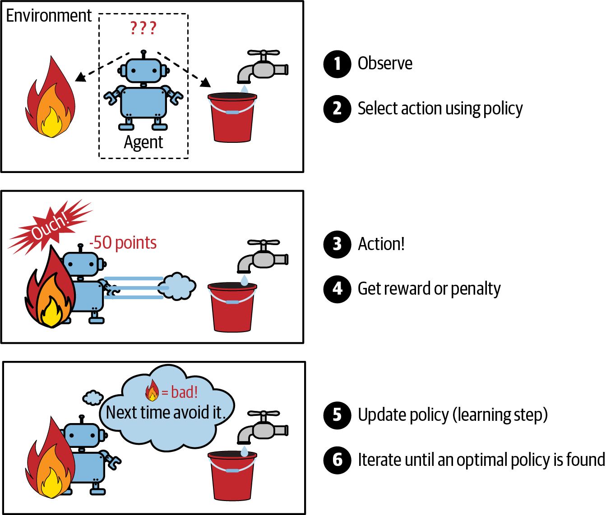

# Reinforcement learning

*Reinforcement learning* is a different beast. The learning system called *agent*, can observe the environment select and perform actions, and get *rewards* in return (or *penalties* the form of negative rewards). It must learn by itself what is the best strategy, basically in which one it gets most rewards over time, and this is called *policy*. A policy defines the action the agent should take when its given a situation.

  

For example, many robots implement reinforcement learning to learn how to walk. In may 2017 a robot called AlphaGo beat the ranked one player in the game *go*. The bot learned by implementing reinforcement learning, by analyzing millions of games and defining its policy. In the game, the learning was turned off, it won just applying its policy. This is called *offline learning.*
