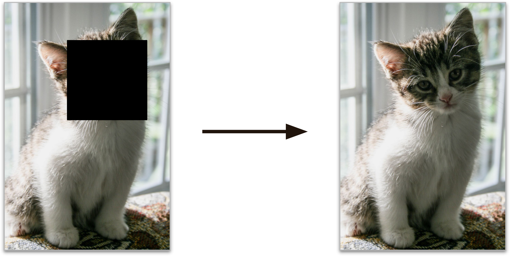

# Self-supervised learning

Another approach to machine learning involves generating labels from fully unlabeled data. Again any dataset that is fully labeled, then it is possible to use any supervised learning algorithm. This is called *self-supervised learning*.

For example, you have a large dataset of unlabeled images, you can randomly mask a part of the picture and then train the model to recover the original image. During the training, the masked images are used as inputs and the original images are used as labels.

  

The resulting model may be quite useful, to repair some images, or even removing unwanted objects, but a self-supervised learning model is not your final goal. Once it works enough, you might want to tweak it and fine tune to do a task you actually care about.

For example, lets say you wanted to make a pet classification model: given any picture of a pet, it can tell you the specie it belongs to. If you have a large dataset of unlabeled images of pets, you can start by training a model that can repair these images using self-supervised learning, once it performing well, it can recognize that it needs to add a cat's face to a cat and not a dog. Assuming your model architecture allows it, it is then possible to tweak the model so it predicts which specie the pet belongs to instead of repairing images. It then can be fine tuned to use a labeled dataset since it already distinguish between them, now it can learn how to map between the already known species and labels we expect from it.

> "Transferring knowledge from one task to another is called *transfer learning*".
