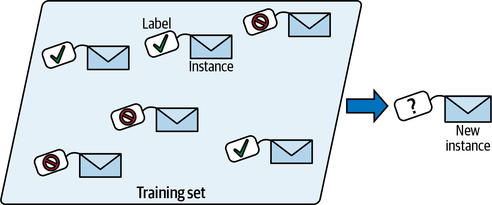
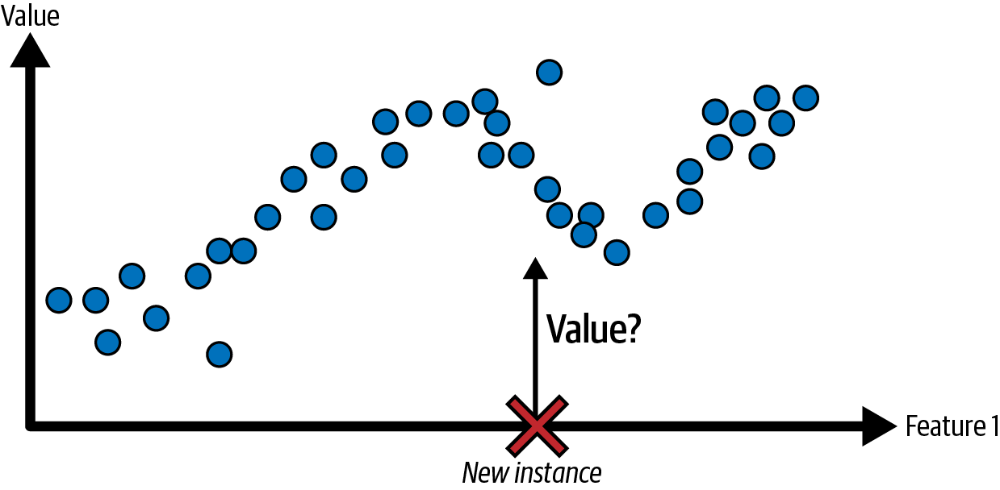

# Supervised learning
In *supervised learning*, the training set you feed to the algorithm includes the desired outputs, called *labels*.

  

A typical supervised learning task is *classification*. The spam filter is a good example of this, the training set will contain emails with their class (spam or ham), based on this, the model will learn how to classify new emails.

Another typical task is to predict a *target* numeric value, such as the price of a car based on many *features*, like (age, brand, etc.). This task is called *regression*. To train the system, you must provide many examples of cars including both their features and their *target* (i.e price.).

Note that some regression models can be used for classification as well and vice versa, an example is *logistic regression*, is commonly used for classification, since it can give you a value that corresponds to the probability of belonging to a class (e.g 20% chance of being spam).

  

> *Words like target and label are generally treated like synonyms in supervised learning, however, target is more common in regression tasks and label in classification tasks.* 