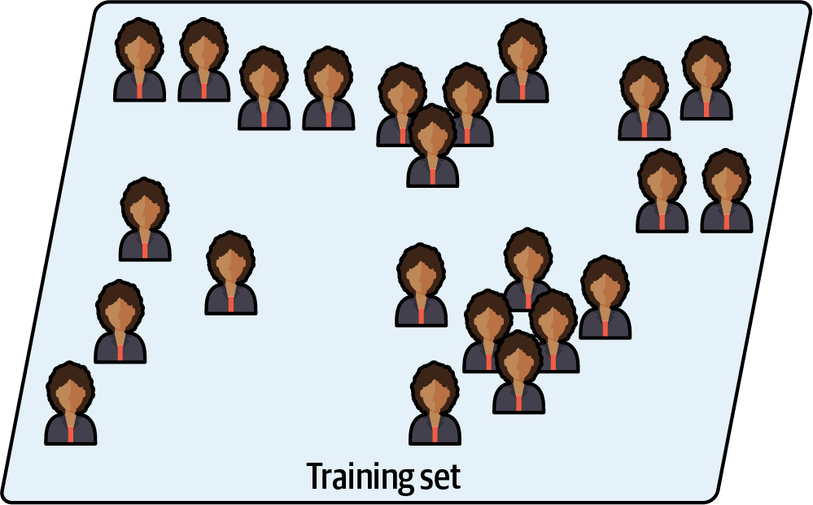
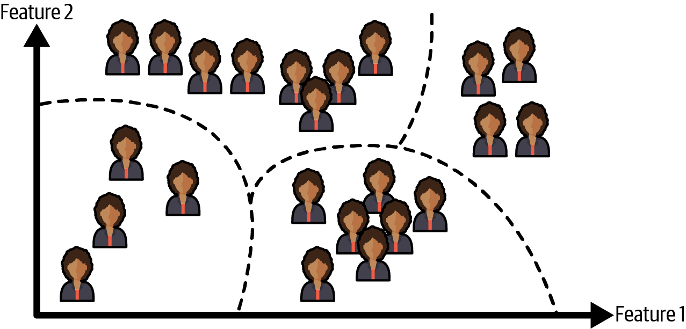
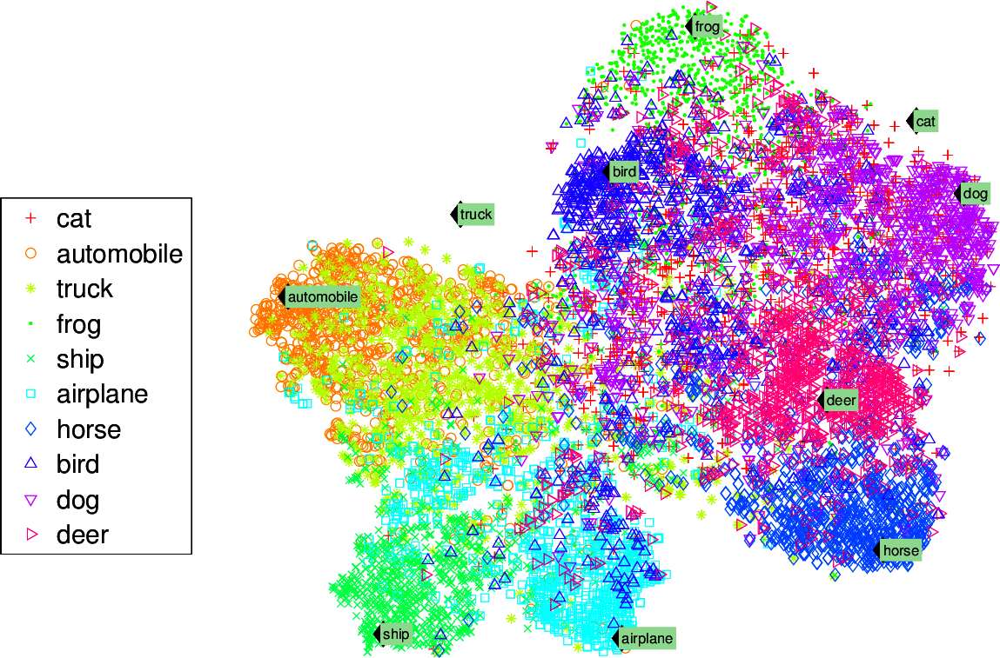

# Unsupervised learning

In unsupervised learning the training data is unlabeled, the system tries to learn without a teacher.

  

For example, lets say you want to know data about tour blog's visitors. You may want to run a *clustering* algorithm to try to detect groups of similar visitors. You don't tell the algorithm which group of visitors belong to: it finds those connections without your help. For example, it might notice that 40% are teenagers that love comic books and read them after school, and that 20% are adults that love sci-fi and read them during the weekends. If you use a *hierarchical clustering* algorithm, it may also subdivide each group into smaller groups, this may help so you can target your posts for each group.

  

*Visualization* algorithms are also good examples of unsupervised learning: you feed the model complex and unlabeled data, and they output a 2D or 3D representation that can be easily plotted. These algorithms try to preserve as much structure as they can (e.g trying to keep separate clusters from overlapping) so you can understand how data is organized and perhaps identify unsuspected patterns.

  

A related task is *dimensionality reduction*, in which the goal is to simplify the data without loosing to much information. One way to do it is to merge several correlated features into one, lets say the car's mileage is heavily related to its age, so these features merge in one feature. This is called *feature extraction.*

Another important unsupervised task is *anomaly detection*-- for example, detect unusual credit card transactions to prevent fraud, catching manufacturing defects. The system is shown mostly normal instances during training, so it learns to recognize them; then, when it sees a new instance it can tell whether it looks like a normal instance or like an anomaly.

A very similar task is *novelty detection*, this one aims to detect new instances that looks different from instances in the training set. This requires a very "clean" training set. For example, if you have thousands of photos of dogs, and 1% of those are Chihuahuas, then the *novelty detection* algorithm should not treat new pictures of Chihuahuas as novelties. On the other hand, the anomaly detection algorithm may classify it as an anomaly, since it may consider this dog is very rare from the other dogs.

Finally, another common unsupervised task is *associative rule learning*, in which the goal is to dig in large amounts of data to discover interesting relations between attributes. For example, lets say you run a super marker, running an associative rule on your sales, may reveal that people that buy ketchup and fries also tend to buy steak. Thus, you may want to place these items closer.

